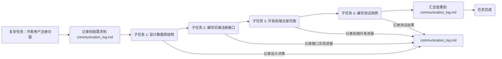
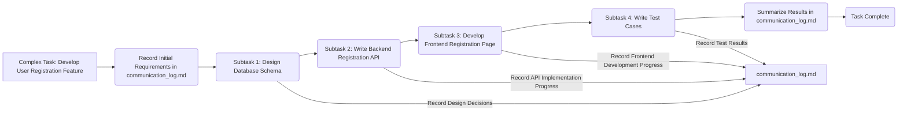

# AI 任务模型：Roo Code 任务编排自定义模式 - 国王模式（King）

## 简介

本项目提供了一个针对 Roo Code 插件的自定义模式配置，即**国王模式（King）**，旨在帮助用户更高效地利用 Roo Code 的任务编排（Boomerang Tasks）功能。通过这个自定义模式，您可以轻松地将复杂的开发任务分解、委托给不同的专业模式处理，从而提升工作效率和项目管理能力。

**测试结果：** 使用 deepseekv3-0324、gemini-2.5-pro-exp-03-25 和 gemini-2.5-fash-preview-04-17 测试该模式，该模型的表现都非常亮眼，能很轻松地应对复杂的任务要求。

**核心功能：**

*   实现 Roo Code 中的任务编排（Boomerang Tasks）。
*   支持将复杂任务分解为可管理的子任务。
*   能够将子任务委托给最适合的 Roo Code 模式（如 Code, Architect, Debug 等）。
*   **利用 `communication_log.md` 作为任务编排的中心日志和协调枢纽。**

**优势：**

*   **应对复杂性：** 有效管理大型、多步骤的项目。
*   **专业化处理：** 利用不同模式的专业能力，优化任务执行。
*   **保持专注：** 子任务在独立上下文中运行，主任务保持清晰。
*   **透明化与可追溯：** 通过 `communication_log.md` 清晰记录任务进展、决策和结果。

## 什么是 Boomerang Tasks (任务编排)？

Boomerang Tasks，也称为子任务或任务编排，是 Roo Code 提供的一种强大的工作流管理机制。它允许您将一个复杂的、端到端的任务分解成一系列更小、更易于管理的子任务。每个子任务都可以在其独立的上下文环境中运行，并且可以被分配给最适合该任务性质的 Roo Code 模式来执行。

这种机制的核心思想是将复杂问题分解，并利用不同模式的专业性来高效地解决每个分解后的部分，最终通过子任务的完成而推动整个复杂任务的进展。

## 工作原理

本自定义模式作为任务编排的“协调者”，其工作流程如下：

1.  **任务接收与分析：** 当您向此模式提供一个复杂任务时，它会首先分析任务需求。
2.  **初始化日志：** 在开始任务编排前，模式可能会在 `communication_log.md` 中记录初始任务需求。
3.  **任务分解：** 根据任务的复杂性和性质，模式会将任务分解成一个或多个逻辑上独立的子任务。
4.  **子任务委托：** 对于每个分解出的子任务，模式会判断最适合处理该任务的 Roo Code 模式。
5.  **启动子任务：** 模式使用 Roo Code 的 `new_task` 工具来启动子任务。在启动时，会将必要的上下文信息和明确的任务指令通过 `message` 参数传递给子任务，**这些指令会强调子任务需要与 `communication_log.md` 交互。**
6.  **子任务执行与日志记录：** 被委托的子任务在其独立的上下文中运行，并按照接收到的指令执行任务。**在执行过程中，子任务会根据指令在 `communication_log.md` 中记录关键的进展、做出的决策以及阶段性成果。**
7.  **子任务完成与总结：** 当子任务完成其目标后，它会使用 `attempt_completion` 工具来结束任务，并通过 `result` 参数向父任务提供一个简洁的任务总结。**这个总结通常会引用或链接到 `communication_log.md` 中记录的详细信息。**
8.  **父任务恢复与继续：** 父任务（即本自定义模式）接收到子任务的总结后，会根据总结信息**以及 `communication_log.md` 中的记录**来判断整个复杂任务的进展，并决定下一步的操作，可能是启动下一个子任务，或者在所有子任务完成后进行最终总结。

**上下文隔离与信息传递：**

需要注意的是，每个子任务都运行在完全隔离的上下文中，不会自动继承父任务的对话历史。信息传递主要依赖于：

*   **向下传递：** 通过 `new_task` 工具的 `message` 参数，父任务向子任务传递初始指令和上下文，**包括与 `communication_log.md` 交互的要求。**
*   **向上返回：** 通过 `attempt_completion` 工具的 `result` 参数，子任务向父任务返回任务总结，**通常会提及在 `communication_log.md` 中的记录。**
*   **中心日志：** `communication_log.md` 作为所有子任务共享的中心日志，记录整个工作流的关键信息，是事实的单一来源。

## `communication_log.md` 的作用

`communication_log.md` 文件是这个任务编排模式的核心组成部分。它扮演着以下关键角色：

*   **中心协调枢纽：** 记录整个复杂任务的进展、不同子任务的状态和交互。
*   **单一事实来源：** 确保所有参与任务编排的模式和子任务都参考同一个地方获取和记录信息。
*   **进度跟踪：** 详细记录每个子任务的开始、关键步骤、决策和完成情况。
*   **决策记录：** 重要的技术或流程决策都会被记录在此，方便回顾和理解。
*   **成果汇总与链接：** 子任务的详细输出（如代码文件、设计文档等）可以在其他地方创建，但会在 `communication_log.md` 中进行汇总并提供链接。
*   **版本控制：** 建议对 `communication_log.md` 进行版本控制，确保记录的准确性和历史可追溯性。

使用此模式时，请务必关注 `communication_log.md` 文件的内容，它是理解整个任务编排流程的关键。

## 安装与配置

要使用此自定义模式，您需要将提供的配置文件添加到您的 Roo Code 环境中。

1.  **获取配置文件：** 您将获得一个名为 `king_modes.json` 的文件。
2.  **放置文件：** 将 `king_modes.json` 文件放置到您的 Roo Code 项目的根目录。
3.  **重命名文件：** 将 `king_modes.json` 文件重命名为 `.roomodes`（如果您的 Roo Code 配置要求使用此名称）。
4.  **重启 Roo Code：** 为了确保 Roo Code 加载新的自定义模式，您可能需要重启 VS Code 或 Roo Code 插件。

完成上述步骤后，您应该能够在 Roo Code 的模式列表中看到名为 "King" 或您在配置文件中指定的模式名称。

## 使用指南

一旦自定义模式安装成功，您就可以开始使用它来编排任务了：

1.  **切换到自定义模式：** 在 Roo Code 界面中，切换到您安装的自定义模式（例如 "King" 模式）。
2.  **输入复杂任务：** 在对话框中输入您希望分解和编排的复杂任务描述。
3.  **模式分析与分解：** 自定义模式会分析您的任务，并可能向您确认如何分解任务或需要哪些子任务。
4.  **关注 `communication_log.md`：** 在整个任务编排过程中，请密切关注 `communication_log.md` 文件的更新，它会记录任务的详细进展。
5.  **批准子任务启动：** 根据模式的建议，您可能需要批准启动子任务。
6.  **监控子任务进展：** 您可以在 Roo Code 界面中看到正在运行的子任务及其状态。子任务的详细活动会记录在 `communication_log.md` 中。
7.  **查看子任务总结：** 子任务完成后，父任务会收到总结，通常会引导您查看 `communication_log.md` 获取详细信息。
8.  **继续或完成任务：** 根据子任务的总结和 `communication_log.md` 中的记录，父任务会继续下一个子任务或宣布整个任务完成。

## 模式配置详解 (`king_modes.json`)

`king_modes.json` 文件是一个 JSON 格式的配置文件，定义了自定义模式的行为。以下是文件中关键字段的说明：

*   `slug`: 模式的唯一标识符（例如 `"king-mode"`）。
*   `name`: 模式在 Roo Code 界面中显示的名称（例如 `"King"`）。
*   `roleDefinition`: 定义模式的基本角色和能力。
*   `customInstructions`: 提供模式特定的详细指令，指导模式如何执行任务，特别是任务编排的逻辑，**其中包含了如何使用和更新 `communication_log.md` 的详细要求。**
*   `groups`: 定义模式可以访问的工具组。对于任务编排模式，主要依赖 `new_task` 工具，可能不需要太多其他工具权限。
*   `source`: 模式的来源。

您可以根据需要修改 `customInstructions` 字段来调整模式的任务编排逻辑或行为，**特别是关于 `communication_log.md` 的交互方式。**

## 示例

（此部分将根据您的具体示例进行填充）

例如，一个简单的代码开发任务编排流程：

## 贡献与反馈

如果您对本项目有任何贡献、建议或遇到问题，欢迎通过以下方式联系或提交：

*   [链接到您的 GitHub 仓库]
*   [您的联系方式或社区链接]

---

# AI Task Model: Roo Code Task Orchestration Custom Mode - King Mode

## Introduction

This project provides a custom mode configuration for the Roo Code plugin, namely the **King Mode**, aiming to help users leverage Roo Code's Task Orchestration (Boomerang Tasks) feature more effectively. Through this custom mode, you can easily break down complex development tasks and delegate them to different specialized modes, thereby improving work efficiency and project management capabilities.

**Test Results:** Tested this mode using deepseekv3-0324, gemini-2.5-pro-exp-03-25, and gemini-2.5-fash-preview-04-17. The mode performed exceptionally well and can easily handle complex task requirements.

**Core Features:**

*   Implements Task Orchestration (Boomerang Tasks) in Roo Code.
*   Supports breaking down complex tasks into manageable subtasks.
*   Can delegate subtasks to the most suitable Roo Code mode (e.g., Code, Architect, Debug, etc.).
*   **Utilizes `communication_log.md` as the central log and coordination hub for task orchestration.**

**Advantages:**

*   **Handle Complexity:** Effectively manage large, multi-step projects.
*   **Specialized Processing:** Leverage the expertise of different modes to optimize task execution.
*   **Maintain Focus:** Subtasks run in isolated contexts, keeping the main task clear.
*   **Transparency and Traceability:** Clearly record task progress, decisions, and results via `communication_log.md`.

## What are Boomerang Tasks (Task Orchestration)?

Boomerang Tasks, also known as subtasks or task orchestration, is a powerful workflow management mechanism provided by Roo Code. It allows you to break down a complex, end-to-end task into a series of smaller, more manageable subtasks. Each subtask can run in its own isolated context and can be assigned to the Roo Code mode best suited for the nature of that specific task.

The core idea of this mechanism is to decompose complex problems and utilize the expertise of different modes to efficiently solve each decomposed part, ultimately driving the progress of the entire complex task through the completion of subtasks.

## How It Works

This custom mode acts as the "orchestrator" for task orchestration. Its workflow is as follows:

1.  **Task Reception and Analysis:** When you provide this mode with a complex task, it will first analyze the task requirements.
2.  **Log Initialization:** Before starting task orchestration, the mode may record the initial task requirements in `communication_log.md`.
3.  **Task Decomposition:** Based on the complexity and nature of the task, the mode will break it down into one or more logically independent subtasks.
4.  **Subtask Delegation:** For each decomposed subtask, the mode will determine the most suitable Roo Code mode to handle it.
5.  **Launch Subtask:** The mode uses Roo Code's `new_task` tool to launch a subtask. When launching, it passes necessary context information and clear task instructions via the `message` parameter to the subtask. **These instructions will emphasize that the subtask needs to interact with `communication_log.md`.**
6.  **Subtask Execution and Logging:** The delegated subtask runs in its isolated context and executes the task according to the received instructions. **During execution, the subtask will record key progress, decisions made, and intermediate results in `communication_log.md` as per the instructions.**
7.  **Subtask Completion and Summary:** When the subtask completes its goal, it uses the `attempt_completion` tool to end the task and provides a concise task summary to the parent task via the `result` parameter. **This summary will typically reference or link to the detailed information recorded in `communication_log.md`.**
8.  **Parent Task Resumption and Continuation:** Upon receiving the subtask's summary, the parent task (i.e., this custom mode) will assess the progress of the overall complex task based on the summary **and the records in `communication_log.md`**, and decide on the next steps, which could be launching the next subtask or declaring the entire task complete after all subtasks are finished.

**Context Isolation and Information Transfer:**

It's important to note that each subtask runs in a completely isolated context and does not automatically inherit the parent task's conversation history. Information transfer primarily relies on:

*   **Passing Down:** Via the `message` parameter of the `new_task` tool, the parent task passes initial instructions and context to the subtask, **including requirements for interacting with `communication_log.md`.**
*   **Returning Up:** Via the `result` parameter of the `attempt_completion` tool, the subtask returns a task summary to the parent task, **often mentioning the records in `communication_log.md`.**
*   **Central Log:** `communication_log.md` serves as a central log shared by all subtasks, recording key information for the entire workflow and acting as a single source of truth.

## Role of `communication_log.md`

The `communication_log.md` file is a core component of this task orchestration mode. It plays the following key roles:

*   **Central Coordination Hub:** Records the progress of the entire complex task, the status of different subtasks, and their interactions.
*   **Single Source of Truth:** Ensures that all modes and subtasks involved in task orchestration refer to the same place for obtaining and recording information.
*   **Progress Tracking:** Detailed recording of the start, key steps, decisions, and completion status of each subtask.
*   **Decision Log:** Important technical or process decisions are recorded here for easy review and understanding.
*   **Results Summary and Linking:** Detailed outputs of subtasks (e.g., code files, design documents, etc.) can be created elsewhere, but will be summarized and linked from `communication_log.md`.
*   **Version Control:** It is recommended to version control `communication_log.md` to ensure accuracy and historical traceability of records.

When using this mode, please pay close attention to the content of the `communication_log.md` file, as it is key to understanding the entire task orchestration process.

## Installation and Configuration

To use this custom mode, you need to add the provided configuration file to your Roo Code environment.

1.  **Obtain Configuration File:** You will receive a file named `king_modes.json`.
2.  **Place File:** Place the `king_modes.json` file in the root directory of your Roo Code project.
3.  **Rename File:** Rename the `king_modes.json` file to `.roomodes` (if your Roo Code configuration requires this name).
4.  **Restart Roo Code:** To ensure Roo Code loads the new custom mode, you may need to restart VS Code or the Roo Code plugin.

After completing these steps, you should be able to see the mode named "King" or the name you specified in the configuration file in the Roo Code mode list.

## Usage Guide

Once the custom mode is successfully installed, you can start using it to orchestrate tasks:

1.  **Switch to Custom Mode:** In the Roo Code interface, switch to the custom mode you installed (e.g., "King" mode).
2.  **Enter Complex Task:** In the chat box, enter the description of the complex task you want to decompose and orchestrate.
3.  **Mode Analysis and Decomposition:** The custom mode will analyze your task and may ask you to confirm how to decompose the task or which subtasks are needed.
4.  **Pay Attention to `communication_log.md`:** Throughout the task orchestration process, pay close attention to updates in the `communication_log.md` file, as it will record the detailed progress of the task.
5.  **Approve Subtask Launch:** Based on the mode's suggestions, you may need to approve the launch of subtasks.
6.  **Monitor Subtask Progress:** You can see the running subtasks and their status in the Roo Code interface. Detailed subtask activities will be recorded in `communication_log.md`.
7.  **View Subtask Summary:** Upon subtask completion, the parent task will receive a summary, which will usually guide you to view `communication_log.md` for detailed information.
8.  **Continue or Complete Task:** Based on the subtask summary and the records in `communication_log.md`, the parent task will continue with the next subtask or declare the entire task complete.

## Mode Configuration Details (`king_modes.json`)

The `king_modes.json` file is a JSON format configuration file that defines the behavior of the custom mode. Below is an explanation of the key fields in the file:

*   `slug`: The unique identifier for the mode (e.g., `"king-mode"`).
*   `name`: The name displayed for the mode in the Roo Code interface (e.g., `"King"`).
*   `roleDefinition`: Defines the basic role and capabilities of the mode.
*   `customInstructions`: Provides detailed mode-specific instructions, guiding the mode on how to execute tasks, especially the task orchestration logic, **including detailed requirements on how to use and update `communication_log.md`.**
*   `groups`: Defines the tool groups the mode can access. For task orchestration modes, the primary reliance is on the `new_task` tool, and may not require many other tool permissions.
*   `source`: The source of the mode.

You can modify the `customInstructions` field as needed to adjust the mode's task orchestration logic or behavior, **especially regarding interaction with `communication_log.md`.**

## Example

(This section will be populated based on your specific examples)

For example, a simple code development task orchestration workflow:

## Contribution and Feedback

If you have any contributions, suggestions, or encounter issues with this project, please feel free to contact or submit through the following channels:

*   [Link to your GitHub repository]
*   [Your contact information or community links]